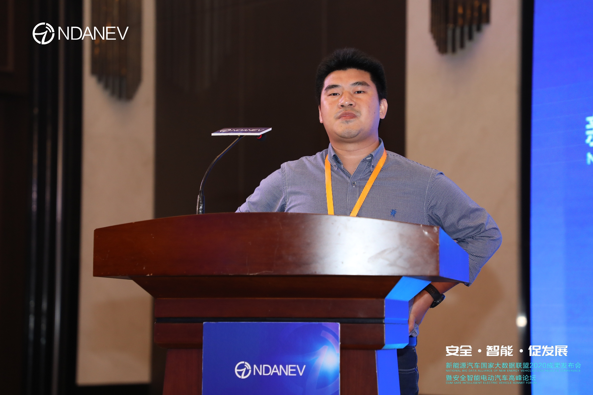
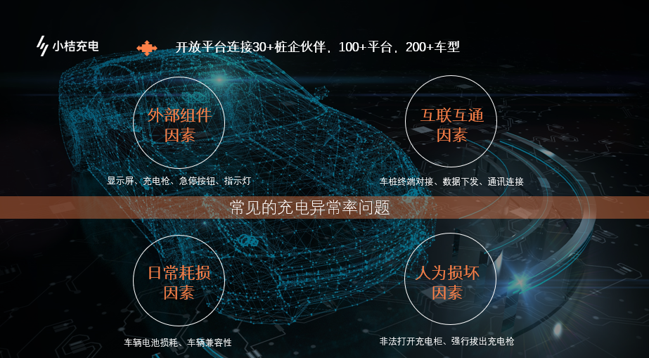
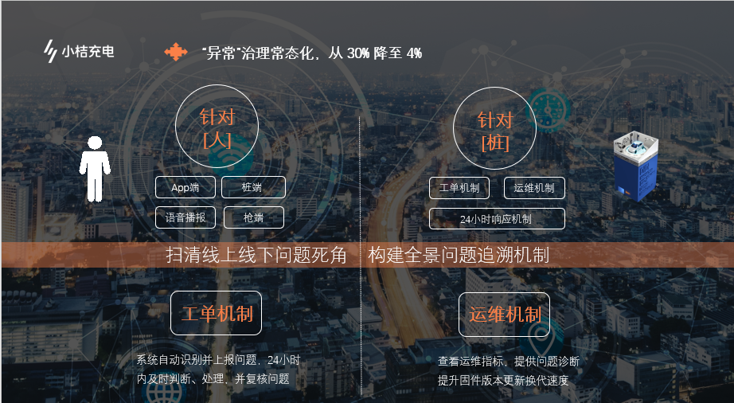
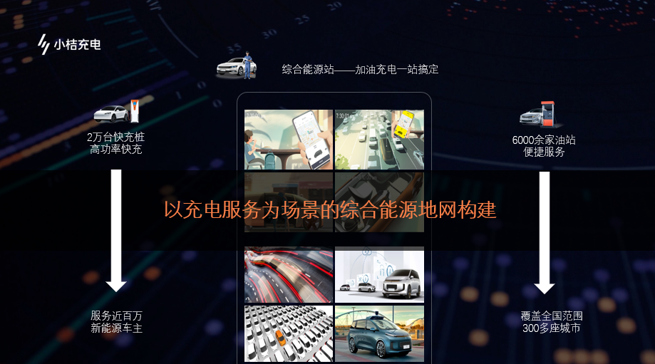

2020年9月15日，由新能源汽车国家大数据联盟与武汉经开区联合主办的“安全·智能·促发展——新能源汽车国家大数据联盟2020成果发布会暨安全智能电动汽车高峰论坛”于湖北省武汉市联投半岛酒店隆重召开。滴滴出行车服技术总监廖兰新给我们做了“从用户体验出发，构建一站式综合能源地网”的主题报告。
 
廖兰新：各位同仁，大家下午好！非常感谢联盟邀请我过来跟产业的前辈学习，今天听了各位专家的分享特别受益，另外滴滴在安全充电方面有巨大的空间，希望更多的合作伙伴跟我们一起合作。
我非常赞成产业数字化、数字产业化的说法，互联网的基本使命是连接，第一个特点是大数据，数字是大数据的一个基础。互联网的第二个特点是面向用户，我们的安全和体验作用于用户才有商业价值。今天跟大家汇报的主题便是从用户体验出发，构建一站式的综合能源地网。
首先给大家介绍一下小桔充电初衷，滴滴希望通过布局汽车整个产业链条以降低生产端的成本，来进一步夯实壁垒，滴滴坚信只有服务好车主才能服务好乘客。随着经济的逐步复苏，我们在今年的日订单突破了5000万订单量，纯电动汽车在平台的注册量达到100万辆，整体的行使里程达到了12亿公里，有42.6%是在滴滴出行这个平台去完成的。
在充电桩行业里面，车主去充电的过程中会发现车位被占，要么是充电枪拔不出来，故障率在30%以上，我们在这块做了非常多的努力。经过统计的分析，我们开放平台目前连接了30家以上的桩企，服务了100家以上的平台，连接了200多个车型。常见的充电异常率表现在哪里？一个是外部组件因素，显示屏、充电枪等可能是失灵的。二是互联互通因素。三是日常耗损因素。这里面的损耗包括充电桩整体的充电模块的日常损耗。另一方面动力电池也是随着时间的推移会损坏。四是人为损坏因素。比如说非法打开充电柜，就会出现一些短路导致关闭。另外用户在使用充电枪的过程比较随意，强行拔枪可能是表面的一些现象。我给大家分享一些充电枪案例，我们发现大量的异常是由于急停导致的。为什么有人按这个？一方面觉得极端的情况肯定很少，不会这么多。第二，难道司机是坏人吗？我们去统计，当司机关闭订单的情况下，超过5秒没有响应就会拍那个急停去完成订单结算的动作。我们通过大数据的分析和用户调研找到了这个规律，后来通过电路性能的优化，给我们非常大的启发是什么？异常率的问题要通过数据分析去找到关联关系，最终找到因果关系，这也是大数据的一个本质。
所以通过我们异常常态化的管理，整个异常从30%降低到了4%，小桔充电建立了一个工单机制，建立了运维机制，24小时完单率已经显著提升。实际上在这个非常简洁的描述背后有一个清晰的技术演进图，我们有275个异常码。我们通过把所有的异常分门别类去分析建模，最终区分了匹配的相关异常，这是第一个阶段。第二个阶段，通过数据建模，真正的引导异常件的发生，我们建立了一个车辆和桩异常的画像，发现部分车和部分桩平常在一起就会出现异常。第三个阶段，我们还做了一些科技赋能。比如说作为一个平台，我们做了异常监控平台，基本上可以快速的推动他们在24小时之内把问题解决。
第三个，针对运营商这边做了一个工单系统，最重要是落实三方的责任，还有商户，还有我们平台，把整个过程科学的管理，但是这个还不是我们技术演进最重要的部分，定制了充电桩的核心组件，定制了云端的通信协议，所以大家可以看到我们每一次的成功充电都蕴含着小桔充电在异常率两年以来所有的努力。
针对安全这块应该是跟我们这个主题特别契合，新能源汽车在目前发展过程中面临最大一块障碍就是新能源车火灾的问题。通过过去充电SOC的曲线，知道哪辆车就是我要拦截的。第二层就是充电桩相关的数据，充电单次的数据以及历史的数据，哪个充电过程是有异常的。第三个部分，跟电池预警这样的技术非常相关，通过车联网的一些数据，更加前瞻性的数据什么时候发生了，发生的火灾的概念是多少。还有一个热失控的红色警戒。国家标准里面提到一点是说，在电池热失控发生之前有多长时间告诉用户你的车可能要着火了，我看国标上是5分钟还是10分钟，就是避免人伤。通过四级的防护体系进行预警，这里面面临两大问题，一是今天车联网或者车企传上来的数据很多时候不准确、不完整、不及时，今天做任何模型数据不完整是很难的。二是今天我们互联网公司最擅长是通过大数据找到规律建模型，在热失控领域真正的样本是很少的，通过机器学习样本是不够的。今天是要借助行业的相关知识，能不能把所有的信号转化成一个模型？比如说是一个单体，这样可以帮助实现这个预警。所以整体而言特别希望跟车企这边把数据去打通，目前跟平台深度合作的车企做了很多贡献，通过DMS的数据共享，建立一个车辆的安全模型。
小桔充电这边提供了充电地图和智能运营和金融赋能，我们能够把整个流量的转化率最大化，我们还提供了一个金融方案。这个也是阐述一下小桔充电的观点，今天我们建了很多充电场站，我们会认为充电场站不应该是一个冰冷的能源的补给站，更应该是一个有品质的生活圈。我们希望构建以充电服务为场景的综合能源地网，把加油和充电一站搞定，未来我们的加油站能够充电，更大的提升场站的利用率，不少的石油巨头已经布局充电桩，我觉得未来是可期的。这是第一个观点。第二个，我们希望构建以充电需求为入口的城市出行生活圈，让我们的充电过程一个小时变得有温度有品质。我们将集成餐饮、按摩、洗车等多种服务，为车主提供多种的体验。
小桔充电已经提供了软硬件一体的解决方案，打造整个能源的生态系统，上面有三个大的板块，一个是针对互联网平台的一个赋能，刚刚提到了国网电动是我们的互联网平台之一，为互联网平台提供整个充电桩的信息服务的充电服务，满足更多的车主充电需求；我们赋能了整个加盟运营商的一个平台，通过互联互通实现一个对接，给运营商带来更多的流量，为运营商提供数据，整体提升数据以及用户体量。不仅如此还给合作伙伴提供硬件商的推荐服务，比如说充电桩的配件提供一些评估方案，保证合作伙伴的权益。还可以补全运营的短板，比如说商务、采购、能源，这个平台也是能够提供这个能力。目前通过开放平台建立了设备运维等连接，全方位去赋能我们的合作伙伴。
所以小桔充电作为滴滴旗下的能源业务，通过场站、油站打造了一站式的入口，为车主提供了便捷、实惠、可靠的能源服务以及基于能源场景的增值服务。经过了两年多的发展，我们的规模其实也取得了一定的成果，特别强调一下我们场站的利用率保持在30%以上。但是作为互联网的一个平台，我们一直是行业的新人，我们去敬畏行业，学习行业，坚持开放平台，坚持合作共赢，与优质的合作伙伴一起共建能源地网，共建服务生态。
我的分享就到这里，感谢大家。
 
点击下载演讲PPT：从用户体验出发，构建一站式综合能源地网

## 图片

