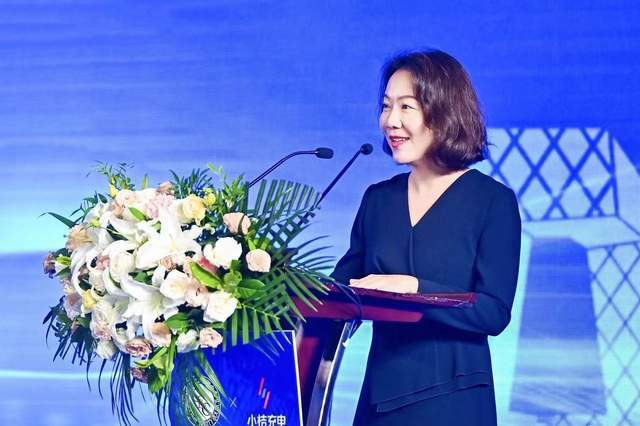

9月14日，中国电力联合会（下称"中电联"）主办、小桔能源独家承办的"第三届电动汽车充换电设施技术创新大会"在北京召开，来自中电联、国家电网等多位嘉宾出席本次会议。

小桔能源总经理解晶晶在致辞时表示，充电行业的数智化转型迎来新的发展机遇，未来，小桔能源会面向全行业，分享多年积累的智能化运营成果，与同业一道，加速充电行业智能化创新，与行业同仁共同建设高质量的充电服务体系。

解晶晶称，小桔能源将数字化能力运用于充电行业，在充电运营智能化方面有许多探索，未来在充电安全、体验管理、智能运维、需求侧电力优化等方面，将不断助力充电行业创新发展。

小桔能源旗下品牌小桔充电是充电设施数智化转型的引领者，成立五年来，坚持探索新型数字技术在充电场景的深层应用，先后推出充电场站数字化解决方案、智能桩解决方案、充电安全解决方案，点对点攻克充电异常率高、安全隐患大、运维成本难降等行业痛点，全面提升充电服务体验和服务保障能力。

同时，首创"特许经营"模式，构建充电服务体验标准化体系，并据此推出更具可靠充电体验的"小桔优选站"，截至目前已在全国150余座核心城市，合作2700家充电商户。

在主论坛上，小桔能源CTO廖兰新发表了主题演讲，分享了他在充电桩智能化升级中的实战经验，首次公开了充电安全、可靠体验、智能运维、电力调度、智能引擎5大智能化关键技术。在他看来，"兼具能源互联、数据智能、生态共创三大特征的充电桩智能操作系统，将重新定义智能充电桩"。

## 图片

> **图片描述**：小桔能源总经理解晶晶在第三届电动汽车充换电设施技术创新大会现场致辞。
