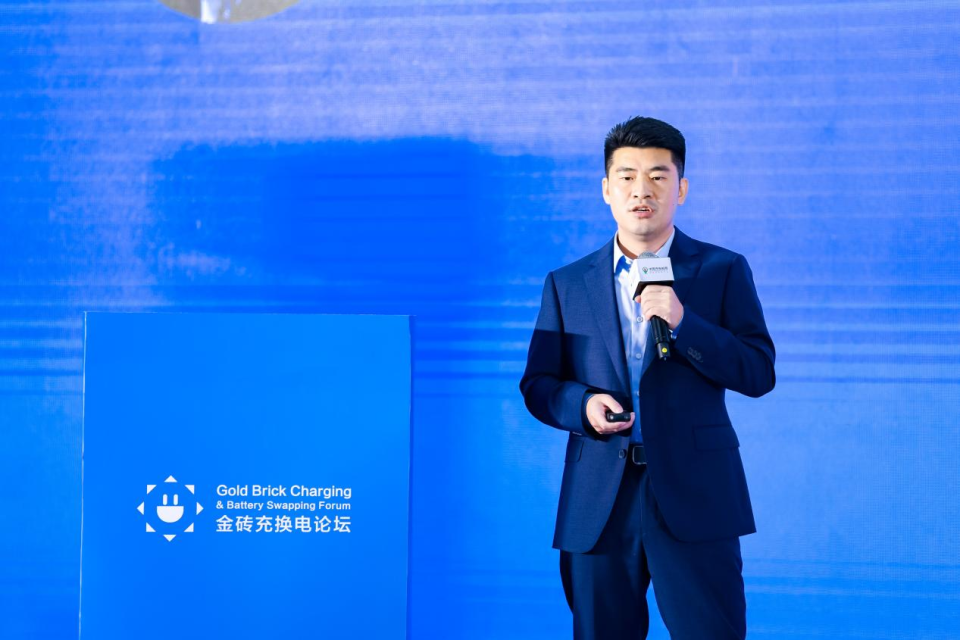
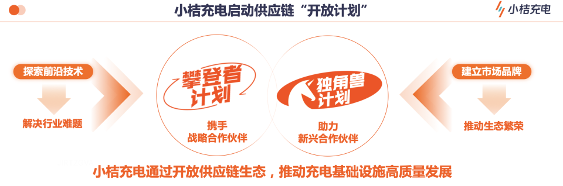
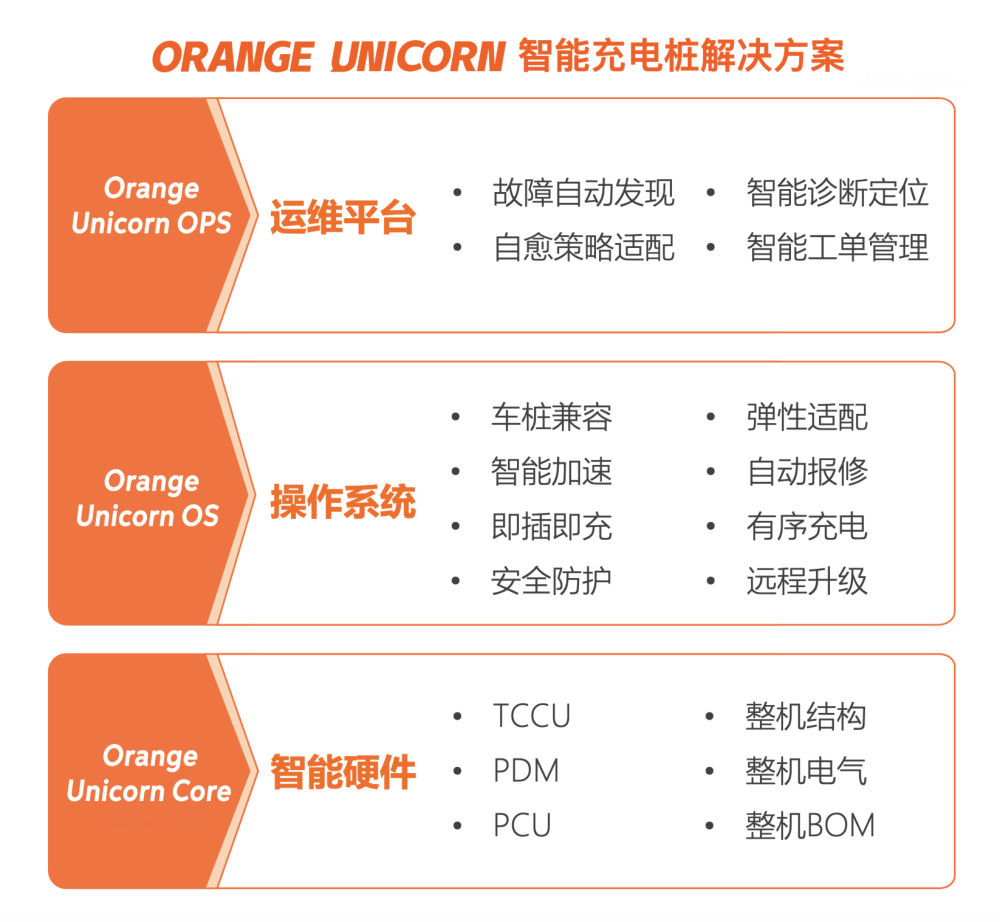

# 小桔充电开放充电桩供应链生态

9月6日，小桔能源CTO廖兰新受邀参加第四届中国国际充换电运营商大会，分享小桔充电对于汽车充电行业提升用户体验和经营效率的技术侧思考与实践，并宣布小桔充电将进一步开放充电桩供应链生态，启动"独角兽计划"，旨在进一步推动充电基础设施高质量发展。

"2019年4月，为提供更好的充电服务，小桔充电开启了生态合作的序幕。四年多来，300多家桩企相继加入了小桔的合作生态。生态伙伴极大地帮助了小桔充电在供给侧的布局，并一同为用户提供了高可用、低异常、大功率的充电服务。"廖兰新说，这使得小桔充电更加坚定地拥抱供应链生态，希望在助力合作伙伴发展方面作出更多努力。

2020年，小桔充电正式启动"攀登者"计划，携手战略合作伙伴，共同探索前沿技术，解决行业难题；此次"独角兽"计划，小桔充电将开放智能运维、充电安全等多领域的技术沉淀，从而助力新兴合作伙伴，快速建立市场品牌，推动充电桩行业生态发展。

廖兰新表示，充电行业一直面临着充电异常率偏高、运维成本高、数字化程度低等诸多挑战。"这不仅降低了充电场站的运营收益，也在不断伤害充电车主用户体验，已经成为行业普遍的痛点。"

"用户体验和商户经营效率是小桔充电的生命线，充电桩作为核心生产要素，在这两方面都起决定性作用。"廖兰新说。

## Orange Unicorn 智能充电桩解决方案

此次，小桔充电公开发布了Orange Unicorn智能充电桩解决方案，"这是小桔充电总结多年充电运营服务实战经验，攻克大量技术难题，沉淀的一套软硬件一体的智能充电桩解决方案。"

Orange Unicorn解决方案分为核心硬件、操作系统、运维平台三层架构，具有免开发、降成本、低异常、智能化的特性。帮助新兴桩企实现快速量产，降低开发、迭代、治理、运维各环节成本，充电桩智能化技术能够提供更好的充电体验和更高的运维效率。

"独角兽计划"授权合作伙伴使用Orange Unicorn解决方案，结合小桔充电生态赋能，助力其快速建立高质量、低成本生产线；建立全国性销售服务网络；建立高效智能运维体系。据悉，目前已经有13家桩企加入了"独角兽计划"。智能运维平台的大盘数据显示，智能化升级后的充电桩，充电跳枪率显著降低。

资料显示，截至目前，小桔充电已提交专利341件，其中113件已获得授权，覆盖智能硬件、安全防护、充电体验、电力调度、智能运维等诸多充电桩关键技术领域，并推出小桔鹰眼、小桔能盾、小桔慧充等在数字化、安全、运营管理等方面的解决方案。

## 图片

