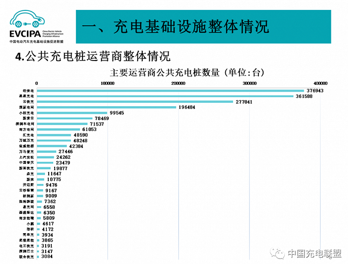
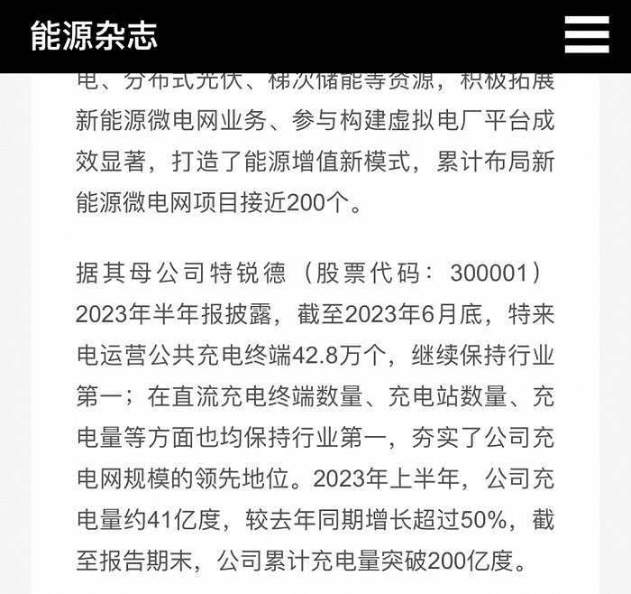

# 手握十余万充电桩，小桔能源依然"慌"

新能源时代，什么市场最火？最先出现在脑海的一定是电动车，但感受过补能"危机"的车主们，第一反应或许是充电服务。

无论是充电桩还是充电站，在中国都是一个巨大的市场，千亿规模的前景吸引着大量不同体量的玩家入局，虽然市场集中度高，但整体竞争却非常激烈。其中一个原因，便是存在不少"平台型"玩家，它们靠连接众多由不同主体运营的充电桩，组成一张服务网络。

中国充电联盟9月11日发布了《2023年8月全国电动汽车充换电基础设施运行情况》，数据显示，TOP15运营商拥有总量94%的充电桩，运营超过10万台充电桩的企业达6家，超过5万台的企业达11家。排名前五的分别是特来电运营45.1万台、星星充电运营40.8万台、云快充运营37.9万台、国家电网运营19.6万台、小桔充电运营12.7万台。

其中，位居第五的小桔充电是一个特殊的存在，因为其背后站着滴滴。脱胎于滴滴曾经的汽车后市场布局——小桔车服，小桔充电实际上是滴滴在发展能源服务过程中"碰上了"新能源浪潮的产物，归属于滴滴旗下小桔能源业务板块。

也因此，小桔能源早期布局不足，能挤进市场前列，靠的是平台化发展，吸收第三方充电桩做大规模。这虽然和星星充电等竞争者路线类似，可惜起步晚，规模稍显落后。

因此，生于忧患，哪怕位列前五、手握十多万充电桩，小桔能源依然有点"慌"。

就在10月9日，市场传出消息，滴滴时隔三年重提增长计划，关键是单量。但相比三年前，出行市场也已经牢牢和新能源绑定，其影响不只在于网约车业务方面，越来越复杂的汽车服务生态也牵动人心。

不过，今天再回顾小桔能源"上位"过程，我们可以看出一丝运气的成分：小桔能源，或者说小桔充电，初期并没有在车服业务的布局中得到足够的重视。它的地位更多来自滴滴在运营出行服务过程中感受到了新能源大势所趋，小桔能源是被市场趋势"抬着升咖"的。

这就不得不提到滴滴曾经对汽车生态的布局。2018年8月，滴滴把自己尝试了三年的汽车服务平台，正式升级为"小桔车服"，并为其注资高达10亿美元。从名称可以看出，当时的滴滴瞄准的还是汽车后市场。

的确，这在当时是一条前途可观的赛道。最简单的案例，是车服市场当时的明星——途虎养车的融资故事。2018年下半年，途虎完成由腾讯、凯雷资本、红杉资本等重量级机构领投的4.5亿美元E轮融资，估值高达165亿元左右。所以，选择切入当红的汽车后市场赛道，对滴滴而言是车辆生态延伸的合理选择。

对比之下，在滴滴做出决策前的2017年，中国汽车工业协会数据显示，全国新能源汽车产销量仅为79.4万辆和77.7万辆，而汽车总销量为2887.89万辆。在当时看来，布局能源，燃油方面本身只能做一些优惠加油之类的平台，战略潜力不足，新能源气候未成，不确定性太大，滴滴选择"稳"一把。

结果，这一"稳"就错过新能源爆发的那一刻。中汽协数据显示，2018年和2019年，国内新能源汽车产销量始终稳定在120万辆之上，较2017年逼近翻倍。最令人警醒的例子是特斯拉，其销售数据显示，2017年到2019年，特斯拉销量从103097辆暴增至367500辆，看似绝对值不高，实际意味着引领品牌一旦出现，市场窗口已经大开。

应对已经是必选项，2019年7月，小桔车服升级组织架构，成立车企业务部和小桔能源业务板块，彼时的小桔能源涵盖加油与充电业务，由滴滴高级副总裁、小桔车服总经理陈汀挂帅，重要性已然不低于定制车、租车等各业务的总和。地位拔高后，滴滴迅速和南方电网等平台合作，小桔充电也开始与其运营的充电平台互联互通。

这已经有些后之后觉。中国电动汽车充电基础设施促进联盟数据显示，截至2019年1月，特来电已坐拥12.2万台充电设施，当时前五家运营商已占有88.4%的市场份额。小桔能源地位迅速上升并聚焦充电，更像是形势所迫，必须追赶。

中国充电联盟数据显示，截止2023年8月，全国充电基础设施累计数量为720.8万台，同比增加199.8万台、67.0%，同期新能源汽车销量则达到537.4万辆。市场缺口依然存在，会吸引更多中小玩家趁着部分地区还有政策鼓励而分散扩大布局。

那么，对于想要在市场建立品牌效应、扩大生态网络的小桔能源来说，滴滴的财务力量显然难以支持其和小玩家一样，四处进行重资产布局。

恰好此时，行业中虽然参与者众多，但因为盲目竞争带来的淘汰者也不少，所以整合需求也处于增强期。小桔能源，抓住了这个机会，开放生态建设平台。

**9月6日，小桔能源CTO廖兰新宣布启动新的供应链开放计划——"独角兽计划"，吸收中小型桩企进入小桔生态，为之提供软硬件解决方案，快速量产布局，从而建立自己的供给能力，对抗特来电这样的产业链玩家。**

另一方面，小桔充电通过特许经营模式，不断吸收联营充电服务商，并为商户提供运营、营销方面的帮助，扩大自己的接入规模。今年3月，小桔充电进一步推出自主标识的"小桔优选站"，开始加强品牌建设。

这种平台型模式，此前已被星星充电验证过。星星充电发展初期，直接采用"众筹建桩""共享充电桩"模式，从而发挥了轻资产优势，做到了行业第二的成绩。不过，这也折射出一个现实，小桔能源要继续扩张，不得不和头部玩家加速赛跑。

至少，相对于此前对后市场一把抓的野心，小桔能源的切入更加精准，这有着滴滴成长历程的影子，即先做好平台，再逐渐以定制车等方式，完善自己的品牌，提供更多服务。但充电服务毕竟不是网约车，可以靠模式解决一切问题。充电领域的竞争才处于起步阶段，小桔能源当前还有很多需要提升的点。

根据小桔充电披露的数据，其充电桩平均利用率达到25%。光大证券曾经测算，充电桩盈亏平衡点的利用率在8%左右。

值得一提的是，小桔能源技术方面以运营工具等"软技术"为主，但当前充电市场内卷加速，光储充一体化等更复杂的布局越发受追捧，面对这种加速构建壁垒的行业态势，小桔能源面临着更大挑战。

总而言之，充电服务市场的核心与终点都是能源新基建，以能源为核心的产业互联网才是大趋势。如此大的行业风口，意味着时间和资源的考验都会放大，小桔能源、小桔充电，无法只靠充电设施数智化运营实现高枕无忧。

## 图片

> **图片描述**：来源中国充电联盟。展示截至 2023 年 8 月全国 TOP15 充电桩运营商运营数量排行，特来电 45.1 万台居首，星星充电 40.8 万台次之，云快充 37.9 万台第三，国家电网 19.6 万台第四，小桔充电 12.7 万台第五。

> **图片描述**：来源能源杂志。该图配合文中"特来电与地方政府合作共建城市充电网"的论述，体现头部运营商通过与国有平台合资模式建立的城市充电壁垒。
