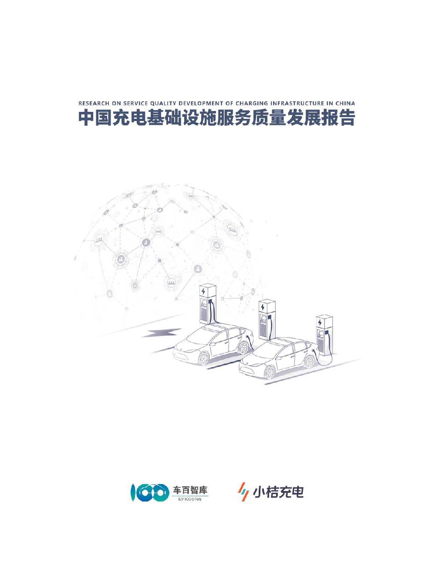

## 概述

中国充电基础设施市场在过去几年迅速发展，已成为世界上规模最大、覆盖最广、设施种类最多的充电基础设施体系。随着新能源汽车市场的强劲增长，该领域在布局规划、场站配置、服务质量、运营管理等方面展现出显著的改进需求。

## 课题组

**课题负责人**：张永伟（中国电动汽车百人会副理事长兼秘书长）

**车百智库**：张健、熊英、卓然、王瑜鸽

**小桔充电**：
- 廖兰新（小桔能源 CTO）
- 楼旸（小桔充电产业链产品负责人）
- 邹莉（小桔充电业务运营专家）
- 黄忆雯（小桔充电业务运营专家）
- 路裕（小桔充电技术专家）
- 陈玮（小桔充电业务运营专家）
- 孙铭佑（小桔充电产品专家）
- 黄涛（小桔充电产品专家）
- 史少晨（小桔能源市场品牌中心负责人）
- 种卿（小桔能源市场营销专家）
- 康利平（滴滴出行集团政府事务总监）
- 张菁菁（滴滴发展研究院高级研究员）

## 摘要

近年来，我国充电基础设施市场快速发展，已建成世界上数量最多、服务范围最广、品种类型最全的充电基础设施体系。然而，面对未来新能源汽车市场的强劲增长预期，充电基础设施在布局规划、场站配置、服务质量和运营管理等方面尚存明显不足与改进空间。从行业监管到企业运营层面，需要以规范管理和服务质量为重点构建评价体系，包括但不限于提升网络布局、优化场站配套、确立运维标准、规范收费机制、强化安全保障能力等，以促进整个充电行业的健康发展。

本报告分析了新能源汽车行业的现况与发展走势，并对充电基础设施高质量发展要求进行了展望。为了全面提升充电服务的效能和质量，需不断优化网络布局设计，强化基础设施承载能力，同时着重提升充电服务的经济性和便捷性体验。报告以用户需求为核心，全面审视并评估了当前充电服务质量的整体状况，并进一步建立了科学严谨的充电服务质量评价系统。最后，针对性地提出了关于充电服务质量改善与发展的系列建议。

## 报告目录

### 一、中国充电基础设施市场发展现状与趋势

- （一）新能源汽车行业发展现状与趋势
- （二）充电基础设施发展现状与需求预测
- （三）充电基础设施高质量发展总体要求

### 二、充电服务质量现状分析

- （一）分析方法与样本设计
- （二）用户分析
- （三）分析结论

### 三、充电服务质量评价体系

- （一）充电网络布局现状
- （二）充电场站环境与周边配套
- （三）充电设备使用及管理
- （四）充电费用清晰
- （五）充电软件使用体验

### 四、充电服务质量发展建议

- （一）服务标准指南
- （二）服务质量提升指南

## 关键图表

报告包含 21 幅图表与 7 张数据表，覆盖：

- 新能源乘用车与商用车销量趋势
- 公共充电桩与新能源汽车 3 年累计销量前十省市
- 截至 2023 年底 TOP10 充电运营商公共桩保有量
- 广州、上海公共充电桩功率分布
- 重点细分市场历年快充次数比例
- 公桩与私桩规模预测
- 充电服务市场规模预测
- 用户充电旅程分析与各类型平台满意度
- 小桔充电指标 NPS 表现
- 私家车车主充电偏好与场站选择
- 不同场景充电功率设计
- 各地区电网代理购电电价峰谷价差

## 结论

通过构建科学的充电服务质量评价体系，针对用户需求和市场趋势提出针对性建议，可以有效提升充电基础设施的服务水平，促进新能源汽车市场的健康、可持续发展。未来，充电基础设施的高质量发展将依赖于技术创新、政策支持、市场机制的优化和用户需求的精准满足。

## 关于车百智库

车百智库是中国电动汽车百人会联合权威机构、产业链头部企业共同发起成立的专业研究机构。自成立以来，车百智库坚持"面向政府和行业，服务战略与决策"的宗旨，围绕汽车电动化、智能化、网联化、绿色化以及能源变革、交通变革、城市变革等多个方向开展研究。

## 图片

> **图片描述**：《中国充电基础设施服务质量发展报告》正式封面，由车百智库（中国电动汽车百人会）联合小桔充电出品，2024 年 4 月发布，封面以橙色调为主，体现小桔品牌色。
