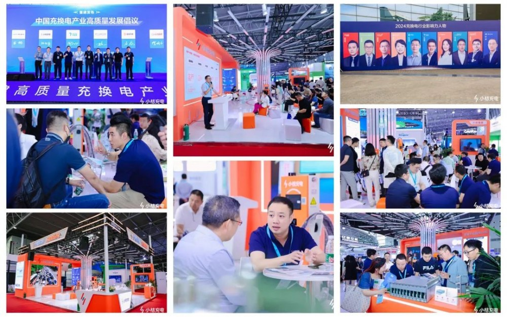
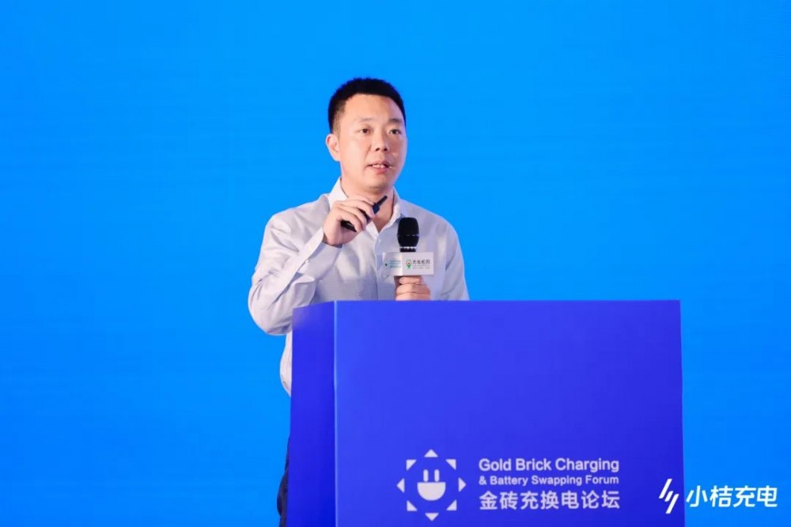
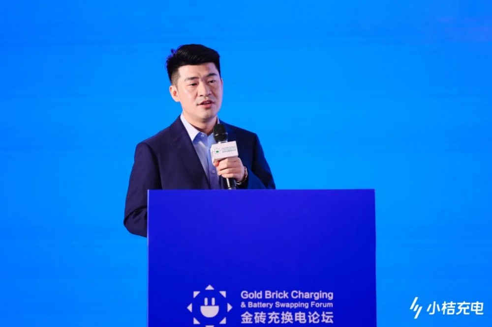
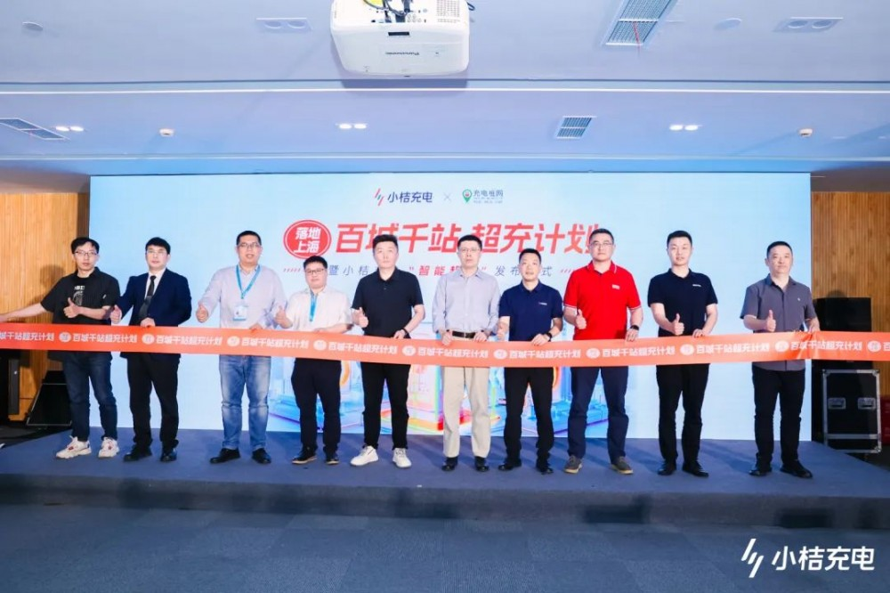

# 小桔充电持续构建开放生态，重磅发布"智能超充解决方案"

5月22日-24日，第三届上海国际充电桩及换电站展览会将在上海汽车会展中心举办，主打"充电就是快"的小桔充电C100展位吸引众多观众参观洽谈，2场主论坛演讲、6场展位宣讲及"百城千站超充计划"落地上海仪式接连掀起互动热潮，同时，现场观众与我们一起见证了小桔充电"智能超充解决方案"的重磅发布。

此外，小桔能源总经理解晶晶获评中国充换电行业十大影响力人物奖；小桔充电获评2024中国充换电行业十大品牌、2024中国充换电行业最佳技术贡献奖、2024中国充换电行业十大光储充解决方案奖。

## 开放生态构建与科技服务创新

"成立至今，小桔充电始终坚持两大核心发展理念：开放生态构建和科技服务创新。"5月22日，小桔能源副总经理林枝棠在2024第十届中国国际电动汽车充换电产业大会上发表主题演讲时表示，作为充电基础设施建设的参与者，只有不断深化生态开放，才能构建智能、快速、标准、安全的行业生态，从而推动充电基础设施的高质量发展。

在共建开放生态层面，小桔充电联合全国4300多家优质商户，搭建覆盖超200个城市的智能快充网络。同时，小桔充电与400余家桩企伙伴共建开放的桩企生态。通过开放小桔在智能运维、充电安全等多领域的技术沉淀，以及推出智能充电桩解决方案，赋能长尾桩企。共同打造高可用、低异常、大功率占比高的高质量充电基础设施。

在科技创新层面，小桔充电充分发挥大数据及创新技术优势，服务更多商户和用户。针对商户的运营痛点，小桔充电先后推出了充电站全场景数智化运营管理SaaS系统——小桔慧充、辅助选址建站的"小桔沙盘"、在线进行设备排查和检修的"小桔慧修"、对场站进行全方位安全管理的"小桔能盾"。面对新能源车主用户，小桔充电陆续上线即插即充、充坏必赔、电池防护、跳枪赔付、加速充等诸多提升充电体验的产品。

## 携"智能超充解决方案"为超充增效

5月23日小桔能源CTO廖兰新在大会主论坛，分享了超充时代下小桔充电兼顾场站运营效率与用户体验方面的技术探索，并公开了自主研发的智能超充解决方案，覆盖设备硬件、设备云平台、用户体验、商户经营全场景，以进一步实现超充布局增效。

廖兰新公布了涵盖全场景的智能超充四大关键技术。在设备方面，小桔充电实现了全矩阵的柔性功率堆，通过将所有充电模块池化，实现对充电枪的动态分配，目前已可量产满载效率达96.3%的高效模块；通过基于车场网全局统筹的电力调度技术的云平台，实现车辆功率需求、场站箱变负载、电网需求响应全局统筹调度最优解，帮助场站全局高峰时段日均提速约8%。

此外，小桔充电基于车桩云协同的自动加速体验技术，在用户充电过程中实现功率加速体验，上线至今日均启动21万次加速；并通过热力雷达和经营模型的超充运营技术，进行用户需求分析、运营效果分析、场站经营模型决策，帮助商户科学决策场站超充配置。

## "百城千站超充计划"落地上海

同期，"百城千站超充计划"落地上海暨小桔充电"智能超充"发布仪式也在上海汽车会展中心举行。上海市发展和改革委员会能源处副处长谢今明表示，上海高度重视充电设施的建设工作，在各部门合力推进和企业积极投建下，上海充电桩总数已接近90万根。他对小桔充电在上海的发展给出了较高评价，"小桔充电2018年进入上海，已有充电站点450个，对上海充电设施建设起到了很好的示范带动作用。"

## 图片

