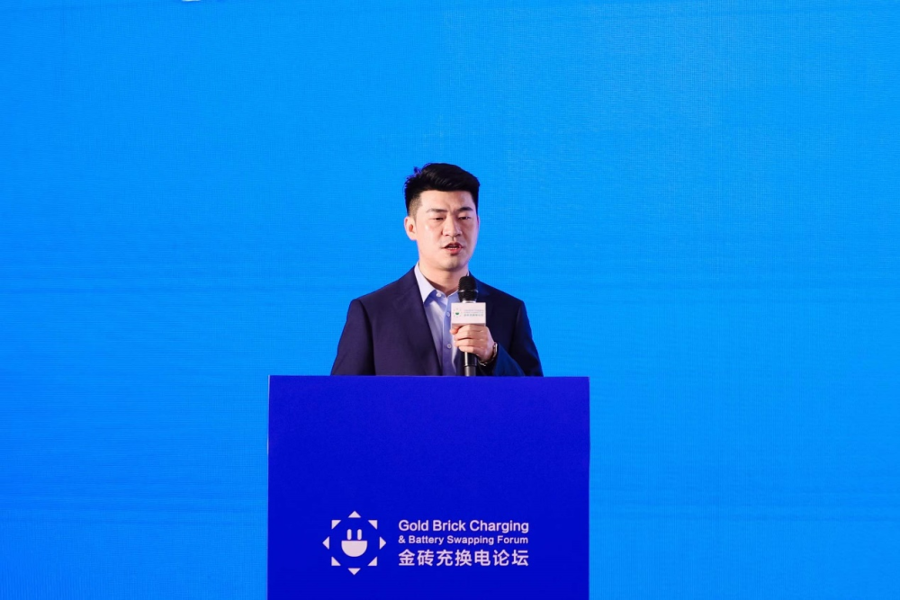
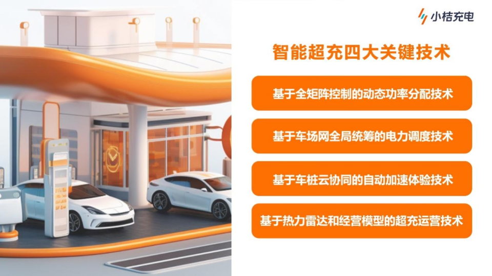

# 小桔充电公开智能超充技术

5月23日，小桔能源CTO廖兰新受邀出席2024第十届中国国际电动汽车充换电产业大会，分享了超充时代下小桔充电兼顾场站运营效率与用户体验方面的技术探索，并公开了自主研发的智能超充解决方案。

随着高压车型持续渗透，产业技术逐步成熟，超充时代已经到来。为了让更多用户享受快速充电服务，充电站选择加大对超快充设备的投建，但成本问题仍需解决。"作为滴滴旗下数智化充电运营商，小桔充电注重用户体验与场站经营的双向提效，该方案能够有效解决实际经营中的难题。目前，小桔充电计划向全行业开放这一方案，共同推进高质量超充网络发展。"廖兰新表示。

小桔充电公开的智能超充解决方案覆盖设备硬件、设备云平台、用户体验、商户经营全场景，以进一步实现超充布局增效。廖兰新公布了涵盖全场景的智能超充四大关键技术。

在设备方面，充电模块颗粒度、共享功率池大小、功率分配灵活性是影响场站经营效率的核心要素。小桔充电实现了全矩阵的柔性功率堆，通过将所有充电模块池化，实现对充电枪的动态分配，目前已可量产满载效率达96.3%的高效模块；并通过基于车场网全局统筹的电力调度技术的云平台，实现车辆功率需求、场站箱变负载、电网需求响应全局统筹调度最优解，帮助场站全局高峰时段日均提速约8%。

此外，小桔充电基于车桩云协同的自动加速体验技术，在用户充电过程中实现功率加速体验，上线至今日均启动21万次加速；并通过热力雷达和经营模型的超充运营技术，进行用户需求分析、运营效果分析、场站经营模型决策，帮助商户科学决策场站超充配置。

## 图片

> **图片描述**：小桔能源 CTO 廖兰新身着深色西装在 2024 第十届中国国际电动汽车充换电产业大会论坛上发表演讲，背景大屏展示"小桔充电"主视觉与超充解决方案标题。

> **图片描述**：四象限技术架构图，列出小桔充电"智能超充四大关键技术"——设备层（全矩阵柔性功率堆）、云平台（车场网全局统筹电力调度）、用户体验（车桩云协同自动加速）、商户经营（热力雷达 + 经营模型超充运营），覆盖设备硬件、设备云平台、用户体验、商户经营全场景。
