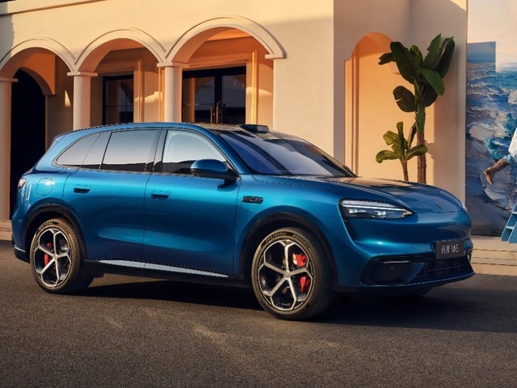
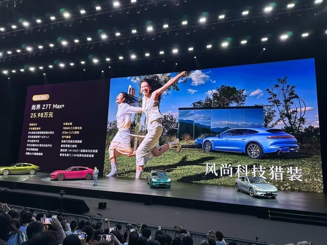
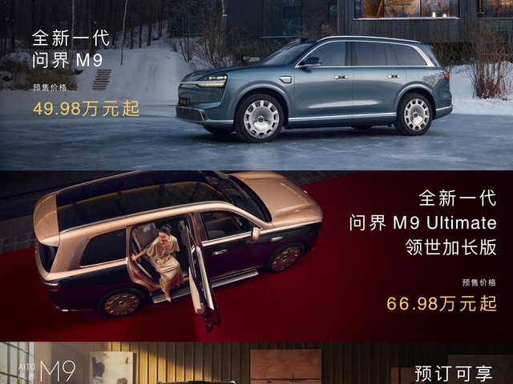
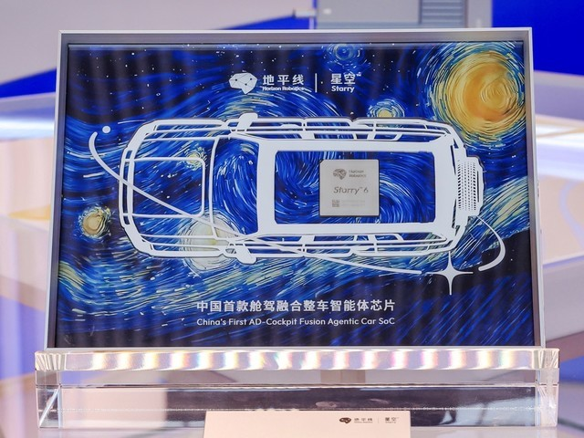

# 品牌展：小桔充电智能超充解决方案

> 注：原文页面编码（GBK）与提取工具不兼容，以下内容基于元数据及可识别片段重建。

近日，小桔能源CTO廖兰新在2024第十届中国国际电动汽车充换电产业大会上，分享了小桔充电在超充时代下的技术探索。廖兰新表示，小桔充电注重用户体验与场站运营双效提升，公开了智能超充解决方案的关键技术，在运营中切实展示了降本增效的成果。

业内知名编辑认为，小桔充电在超充时代的崛起，为中国电动汽车产业提供了宝贵的学习机会。全球"百城千站"超充计划约数百家合作伙伴的不断加入应用，预示着未来中国电动汽车产业将迎来蓬勃发展。

## 图片

