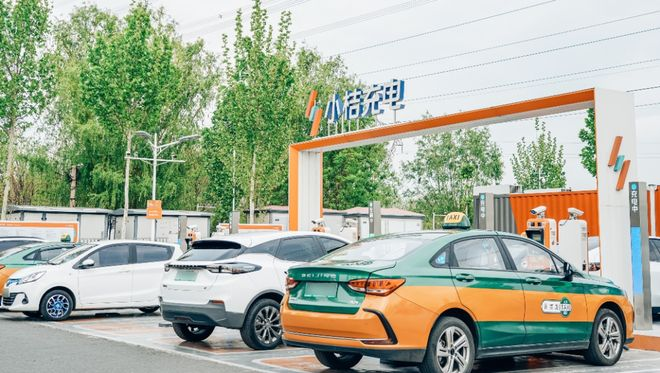

近日，国家能源局发布了我国上半年充电基础设施的建设情况，截至今年 6 月底，全国充电桩总量达 1024.4 万台，同比增长 54%。其中，公共桩 312.2 万台，私人桩 712.2 万台，公共桩额定总功率超过 1.1 亿千瓦，保障了 2400 万辆新能源汽车的充电需求。据中国汽车工业协会发布的统计数据显示，今年上半年，我国新能源车累计产销已超过 3000 万辆，同比增长 32%，占汽车新车总销量的 35.2%，市场渗透率首次突破四成，达 41.1%。

伴随新能源汽车市场高速的发展速度，充电桩作为给新能源汽车补充能源的基础设施，自去年 6 月国务院办公厅印发《关于进一步构建高质量充电基础设施体系的指导意见》以来，其市场规模也在快速发展。国家能源局日前指出，应继续推动构建高质量充电基础设施体系，助力交通运输绿色低碳转型与现代化技术设施体系建设，以更好支撑新能源汽车产业发展。

与此同时，数字化浪潮正在改变充电行业的竞争格局。今年 5 月，国家发改委、国家数据局、财政部、自然资源部四部门联合印发《关于深化智慧城市发展 推进城市全域数字化转型的指导意见》，强调要建设完善数字基础设施，加快推动公共设施数字化改造和智能化运营，利用数字技术提升综合能源服务绿色低碳效益，推动新能源汽车融入新型电力系统，推进城市智能基础设施与智能网联汽车协同发展。

在新能源汽车快速发展和充电行业高质量发展的双重机遇下，充电行业涌现出众多品牌，头部企业之间的竞争也日益加剧，有依靠国家电网资源起家的；有依靠本身充电桩技术优势崛起的；还有在充电桩的运营、服务等方面具有领先优势而崛起的。其中就包括小桔充电这种兼具"互联网基因+生态基因+产业基因"三块长板的数智化运营商。

据了解，小桔充电自行业初期便确立了差异化定位，专注于数智化运营，通过发力数字化和智能化技术研发，持续完善用户体验服务和 B 端商户经营效率。从设备侧的充电桩智能操作系统、智能运维平台，到场站侧的智慧经营、热力选址、电池防护等系统，再到电网侧的光储充一体化微电网、虚拟电厂、电力调度，小桔充电持续投入关键技术研发，充分挖掘数据和算法的价值，在安全、体验、效率等方面取得了显著的成果，进一步助力行业智能健康有序发展。

相较于充电桩生产制造企业，小桔充电依托滴滴互联网技术优势，具备更领先的数字化技术和大数据应用能力；而对比互联网平台，小桔充电更深入产业链，研发了充电桩、电池、电力多项产业技术，能深入解决用户和商户痛点问题。

在生态合作上，小桔充电与众多商户、桩企保持紧密合作，在车企、电池企业、运维服务商、储能厂商、发电企业、金融保险等行业上下游公司展开多类型、多层次的合作，共同解决充电行业难题，提升充电行业服务质量。

小桔能源 CTO 廖兰新表示："小桔充电正在积极推进智能化技术的开放，陆续向行业公开了场站精细化运营、充电桩智能操作系统、科学选址、智能运维、智能超充、电池防护等解决方案。" 当前，响应充电基础设施建设与新能源下乡政策，众多国央企和地方城投公司正加速推动全国充电设施网络布局。小桔充电依托多年技术积累，目前已为数十家行业参与方提供全方位的科技服务，共同助力充电基础设施的高质量发展。

据了解，小桔充电还联合中电联发布了《电动汽车充电设施智能运维技术白皮书》，参编国家市场监督管理总局发展研究中心牵头的《电动汽车公共充电站运营管理服务导则》，发布了《中国充电基础设施服务质量发展报告》等，为行业输出实战经验。

截至目前，作为数智化运营商的小桔充电的服务已覆盖全国 220 多个城市，累计充电超 186 亿度，服务的商户超 5300 多家。小桔充电已提交了国内外专利 356 件，其中 142 件已获得授权，覆盖智能硬件、安全防护、用户体验、电力调度、智能运维、智能超充等诸多充电关键技术领域。

> 文丨本报记者 王长尧 张楠君
>
> 出品 | 中国能源报（ID：cnenergy）
>
> 责编丨李慧颖

## 图片

> **图片描述**：某小桔充电场站实景照片，多排智能充电桩整齐排布，蓝橙配色的"小桔充电"品牌标识清晰可见，新能源车在桩位充电中。
