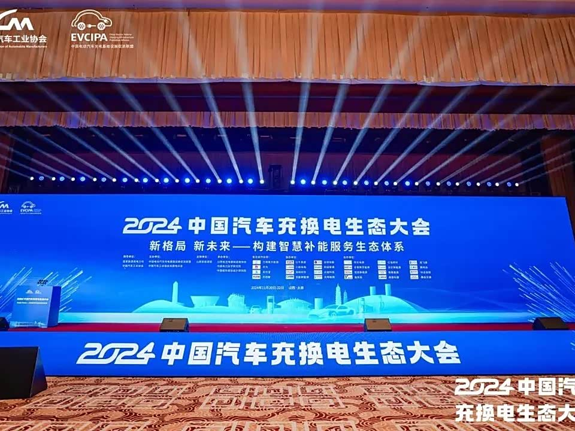

# 充换电产业蓬勃发展，共性议题引发热议

> 本文为2024中国汽车充换电生态大会深度报道，以下摘录与廖兰新相关的"车网互动技术的协同发展与挑战"主题论坛内容。

## 智能充电与电力何以双向协同

新能源汽车的发展为汽车与电力两个行业搭建了合作交流的平台与桥梁。随着电动汽车的普及，车网互动技术已成为提升能源利用效率、优化用户体验、推动智能交通系统建设的关键。这项技术涉及车辆与电网之间的双向互动，包括能量存储、分配、调度等多个方面，是实现智能充电、智能出行和智能服务的重要基础。

在"车网互动技术的协同发展与挑战"主题论坛上，中国汽车工业协会副秘书长杨中平，中国电力科学研究院研究室主任李涛永，上海电器科学研究所运营总监黄向南，国网浙江省电力有限公司衢州供电公司车网互动柔性团队专家丁霄寅，小桔能源CTO廖兰新，东风汽车集团研发总院新能源系统开发室经理史来锋，支付宝新能源首席架构师王力，领充新能源常务副总裁周强，深圳英飞源产品总监张春明等嘉宾就车网互动技术研究与实践、新能源汽车下乡背景下更高效的车网互动发展模式等话题展开研讨。

廖兰新指出，当前充换电平台的发展关键在于依托虚拟电厂角色，打通电力交易市场。他总结了虚拟电厂需具备的三大核心能力：聚合、调度与交易，并提出以下技术方向：

一是智能化虚拟微网。通过智慧物联连接电器设备，构建弹性可控的虚拟微网，实现灵活组网；

二是实时、灵活的技术架构。更新协议至实时信号，推动双向电力云端化，并预留系统兼容性；同时开发灵活的多场景组网与实时多维度建模技术，以适应需求侧响应；

三是分层调度优化。基于微网能量最优调控，建立单厂站自治微电网，并在时空维度优化车辆调度，综合考虑电池状态、站点距离及费用，提升调度效率。

## 图片

