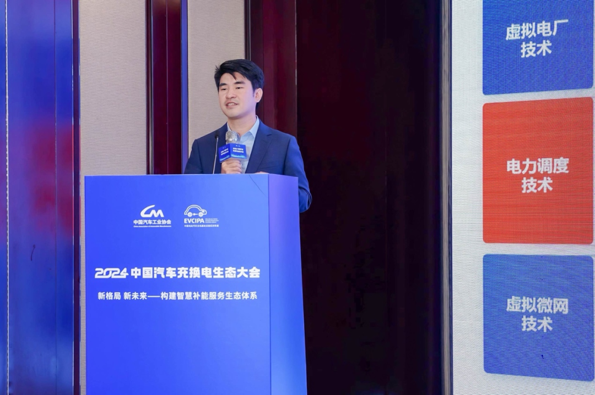
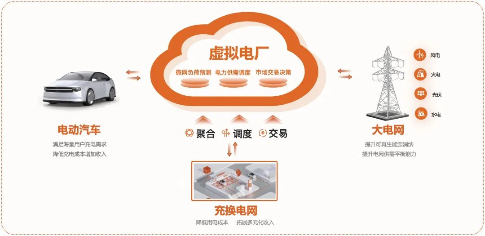
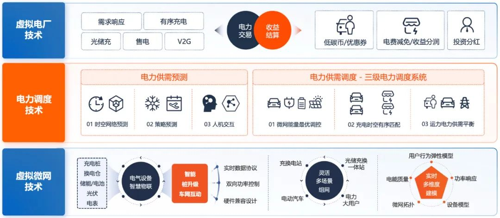
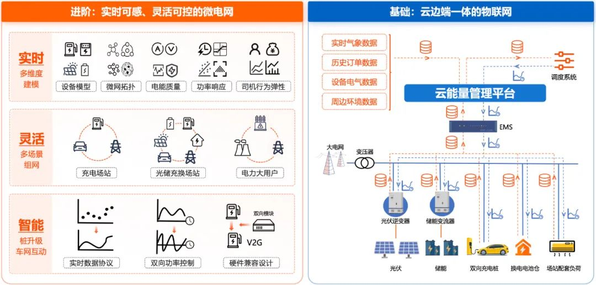
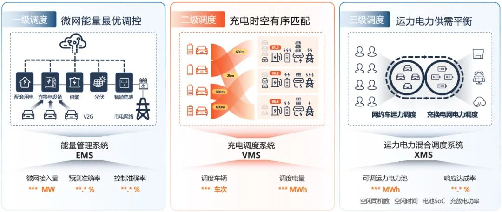

# 小桔充电公开"车网互动"三大关键技术

近日，小桔能源CTO廖兰新受邀发表主题演讲《充换电平台车网互动关键技术》，分享了小桔充电过去四年在车网互动技术上的探索与实践，为充换电基础设施行业在充电负荷管理、电力需求侧响应、虚拟电厂建设等方面提供了宝贵经验。

近年来，车网互动相关政策导向日趋明朗。2023年6月，由国家能源局发布的《新型电力系统发展蓝皮书》指出，源储荷网"智慧融合"是构建新型电力系统的必然要求。2024年7月，由国家发改委、能源局等三部门联合发布的《加快构建新型电力系统行动方案（2024-2027）》，明确要求"加强车网互动"、"开展高比例的需求侧响应"、"建设一批虚拟电厂"。2024年8月，国务院新闻办公厅向全球发布了《中国的能源转型》白皮书，明确提出"大力发展能源新质生产力"，"加快建设新型电力系统"。

"车网互动的本质是以充电桩为媒介，实现新能源汽车与电网之间的智慧融合。"在廖兰新看来，充电桩、充电站和换电站，通过车网互动技术来构建电力需求侧响应能力，通过虚拟电厂接入电力交易市场，最终成为新型电力系统的重要组成部分。欧阳明高院士将车网互动分为三个发展阶段：无序充电、智能有序充电和V2G双向互动。廖兰新称，从无序到有序是当前所处的发展阶段，智能化技术在负荷预测和电力调度方面发挥空间巨大。

## 充电网升级为虚拟电厂，智能化技术助力车网融合互动

早在2021年9月，小桔充电就开始探索将充电网升级为虚拟电厂。经过四年的技术迭代，小桔充电实现了充电负荷和储能的聚合管理能力；实现了用户车辆调度能力、充电桩功率调节能力；同时，与全国40多个城市的电力市场建立了交易结算能力。逐步夯实了虚拟电厂的三大核心能力：聚合、调度、交易。

今年10月，小桔充电对虚拟电厂进行了智能化升级，建立了更准确的负荷预测能力、更弹性的电力调度能力，大幅提升了电力市场的响应能力。在深圳、上海、浙江等成熟的电力市场中实现了长期响应精度领先的成绩。

目前，小桔虚拟电厂已实现辅助服务常态化，需求响应时长近4000个小时，调峰电量超1000万千瓦时，为商户增收1500+万元，响应精度基本上保持在95%以上，通过调峰累计减碳超5500吨。为了增强虚拟电厂的调度能力，小桔充电积极拓展储能规模划化经营，目前已签约储能项目超500个，上线运营项目超100个。同时，小桔充电积极开展V2G实践，已在广州、上海建立了全国首批V2G示范站，并参与多个车网互动国家标准和行业标准的制定。

## 关键技术1：充换电平台场景，车网互动技术架构

第一个关键技术是车网互动技术的顶层架构设计。在整个架构设计中，位于底层的是虚拟微网技术，首先完成所有电气设备的智慧物联，然后实现灵活的多场景组网，同时确保微电网弹性可控；其次是构建位于顶层的虚拟电厂技术，支持需求侧响应、有序充电、购售电等电力业务场景，对接电力市场完成电力交易，取得收益和各参与方完成分配；最后是位于中间层最核心的电力调度技术，通过提升供需预测的准确性和电力调度的灵活度，不断提高电力需求响应精度，满足电网的调度需求。

## 关键技术2：实时可感、灵活可控的虚拟微网

第二个关键技术，是实时可感、灵活可控的虚拟微网技术。通过云边端一体化协同就能够完成智慧物联。简单说就是："状态信号能上来，控制信号能下去"。但是要实现实时可感、灵活可控，才能为上层电力调度技术提供较高的确定性。对于充换电平台而言，我们实现了三个特性：智能、灵活、实时。首先，通过充电桩智能化升级，实现实时数据协议，建立云端的双向功率控制能力，硬件上没有实现双向充放电的也预留了兼容接口。其次，面对充电站、换电站、光储充一体综合站以及其他电力大用户，具备多场景灵活组网的能力；更重要的是，要对所有的调度因子做实时建模。具备三个特性的虚拟微网技术，可以为电力供需预测和电力调度提供基础保障。

## 关键技术3：基于负荷预测和运力弹性的智能调度

凭借运力调度优势，小桔充电逐步构建了"三级电力调度系统"，积极探索交通运力与电力的双向调节和平衡能力。从微观到宏观，小桔充电智能调度可分为三级。一级调度是在单一场站建立微电网自治能力，借助微网负荷预测和灵活控制能力实现微电网内局部最优调控，最终达到能量最佳利用；二级调度是建立充换电车辆与充换电场站的时空匹配能力，包括车辆电池状况、车辆与场站距离、实时电价等关键因素，完成片区充换电时空有序匹配，促进电能高质量利用；三级调度则是建设运力与电力统一的调度系统，在出行场景外充分利用空闲运力，通过动态调度等形式引导新能源汽车参与电力辅助服务，变成可调控的电力单元，从而促进宏观运力电力供需平衡，提升电网整体的运行效率与稳定性。

"智能化是小桔充电一直以来的技术战略，更是推进车网互动的关键。"廖兰新表示，未来新能源汽车将变身移动的"充电宝"，充分发挥移动储能的灵活电力调节能力，为新型电力系统高效运行提供支撑。

## 图片

