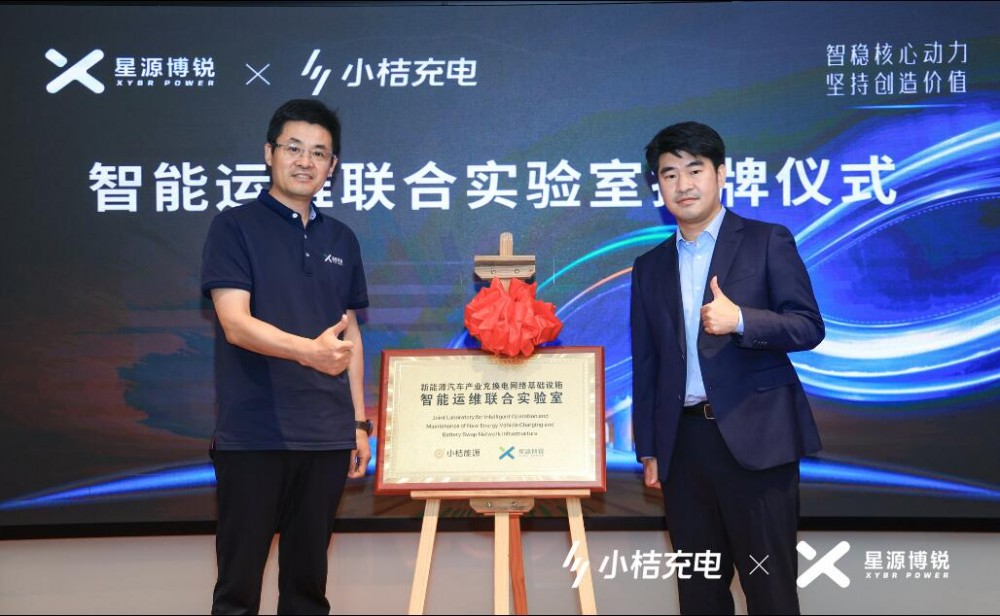
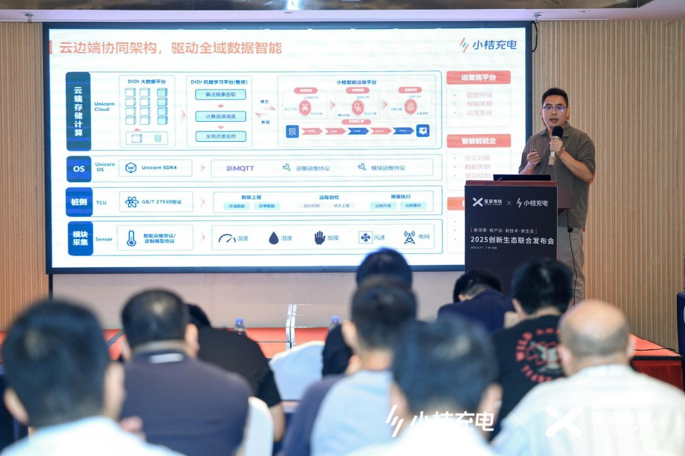
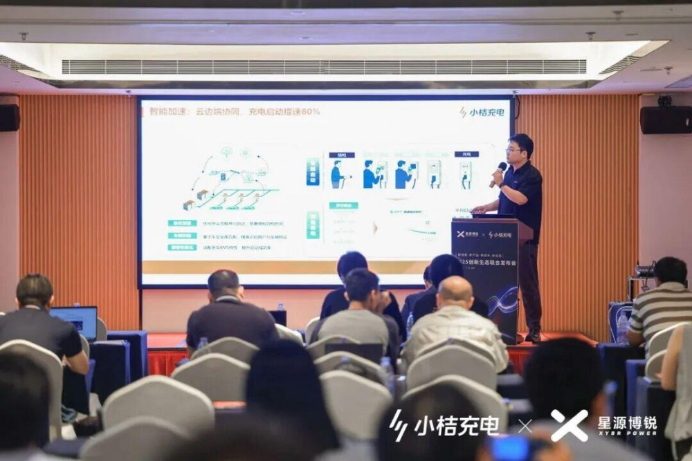

# 小桔充电与星源博锐成立联合实验室，共建模块级智能运维技术

近日，小桔充电携手星源博锐在深圳宣布成立新能源汽车产业充换电网络基础设施"智能运维"联合实验室。通过联合研发，小桔充电将智能运维技术深入到"模块级"，同时将进一步发挥模块侧和平台侧的合力，将技术成果转化成产品价值并传递给客户。

"'全面推进智能化'一直是我们坚守的技术路线。"小桔能源CTO廖兰新在签约仪式上表示，小桔充电依托平台生态优势，充分挖掘数据潜力，通过智能化技术为用户打造优质体验，为商户提升经营效率。而星源博锐在充电模块方面的技术沉淀和创新能力有目共睹，希望通过此番携手给整个生态带来更多创新活力。

## 深入设备核心零部件，智能运维技术迈向新高度

构建高质量充电基础设施，已经逐步成为行业共识。2025年7月，国家发改委等四部门联合发布了《关于促进大功率充电设施科学规划建设的通知》，要求充电运营企业加快智能运维平台建设，强化设备状态监测与故障处理能力，力争使设备可用率不低于98%。在这一政策背景下，智能运维的重要性进一步凸显。

早在2018年，小桔充电开始布局智能运维技术，经过数字化、智能化、生态化三个阶段的攻坚，智能运维平台逐步完善，设备运维工作进入常态化运营，设备可用率逐年提升至98.7%。2023年9月14日，小桔充电向行业公开了充电桩智能化五大关键技术，其中就包含"智能运维"技术；同时公开发布和解读了由中国电力企业联合会牵头，小桔能源等8家单位参编的《电动汽车充电设施智能运维技术白皮书》；2024年2月，小桔充电与星源博锐成立"模块级智能运维"联合项目，通过挖掘模块传感器数据构建算法模型，大幅提升了充电设备的故障诊断能力。

"智能运维的关键在于数据，模块级智能运维将提供更小颗粒度的数据感知，提升智能运维引擎的准召率，拓展更多的应用场景。"小桔充电智能运维技术负责人田彪介绍称，联合实验室将围绕三大维度展开：一是在充电模块中加设传感器，实现环境与基础数据的多维采集；二是基于标准化智能运维协议，增强系统间信息互通与数据传输能力；三是通过智能策略分析，不断拓展运维场景应用的深度与广度。

## 软硬件协同创新，小桔智能充电解决方案再升级

除模块级智能运维之外，小桔充电与星源博锐共同升级了软硬件一体的智能充电解决方案：Orange Unicorn 2.0。新版本将原生支持星源博锐全矩阵CPR和高效率模块。同时，在小桔充电全系列平台产品中，加入模块级故障诊断能力。比如，面向商户的小桔慧充、面向运维服务商的小桔慧修、面向桩企的Unicorn智能桩工作台。使用了该方案的商户和桩企，能够显著提升充电设备的故障发现、诊断和处理能力。

"这次智能化升级突出的成果，就是在充电速度上带来了全流程的加速体验，用户等待显著缩短，场站运营效率同步提升。"小桔充电智能充电桩技术负责人吴博超表示，智能加速效果的实现主要体现在三个维度：一是通过硬件协同实现模块级智能调度，按需动态分配输出，保障整体效率；二是推行极速启动技术，优化启动流程，把充电启动时间从几十秒缩短到几秒钟；三是通过云端智能车型匹配，为用户精准推荐最优充电方案，让充电过程更加顺畅高效。

为了全面推进充电桩智能化升级，小桔充电打造了"3+X"智能桩关键能力。其中，"3"代表三项基础能力——安全防护、智能运维与车网互动，"X"代表用户体验，也代表无限可能，目前已推出包括即插即充、智能加速、极速启动在内的一系列小而美的体验创新。截至目前，小桔充电大约20万充电设备完成了智能化升级。

廖兰新表示，小桔充电将继续开放供应链生态，通过"攀登者计划"携手战略合作伙伴，探索前沿技术，解决行业难题；通过"独角兽计划"携手新兴合作伙伴，建立市场品牌，推动生态繁荣。小桔充电将持续分享智能化技术成果，推动充电设备智能化升级，为行业高质量发展贡献力量。

## 图片

