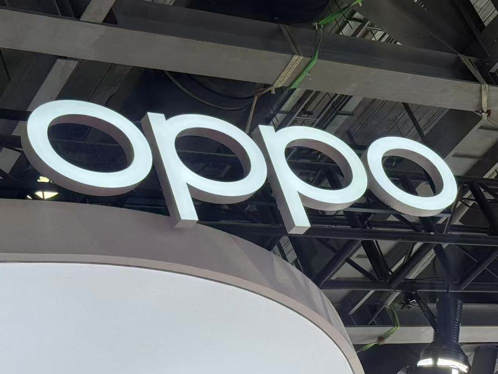

小桔充电近日携手星源博锐在深圳成立新能源汽车产业充换电网络基础设施"智能运维"联合实验室。小桔充电将智能运维技术深入到"模块级"，同时将进一步发挥模块侧和平台侧的合力，将技术成果转化成产品价值并传递给客户。

早在2018年，小桔充电开始布局智能运维技术，经过数字化、智能化、生态化三个阶段的攻坚，智能运维平台逐步完善，设备运维工作进入常态化运营，设备可用率逐年提升至98.7%。2023年9月14日，小桔充电向行业公开了充电桩智能化五大关键技术，其中包含"智能运维"技术；同时公开发布和解读了由中国电力企业联合会牵头，小桔能源等8家单位参编的《电动汽车充电设施智能运维技术白皮书》；2024年2月，小桔充电与星源博锐成立"模块级智能运维"联合项目，通过挖掘模块传感器数据构建算法模型，大幅提升了充电设备的故障诊断能力。

"智能运维的关键在于数据，模块级智能运维将提供更小颗粒度的数据感知，提升智能运维引擎的准召率，拓展更多的应用场景。"小桔充电智能运维技术负责人田彪介绍称，联合实验室将围绕三大维度展开：一是在充电模块中加设传感器，实现环境与基础数据的多维采集；二是基于标准化智能运维协议，增强系统间信息互通与数据传输能力；三是通过智能策略分析，不断拓展运维场景应用的深度与广度。

## 图片

