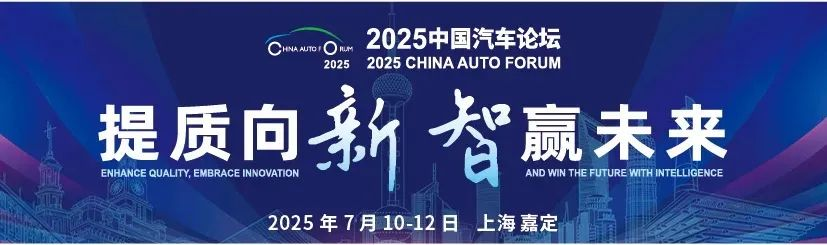
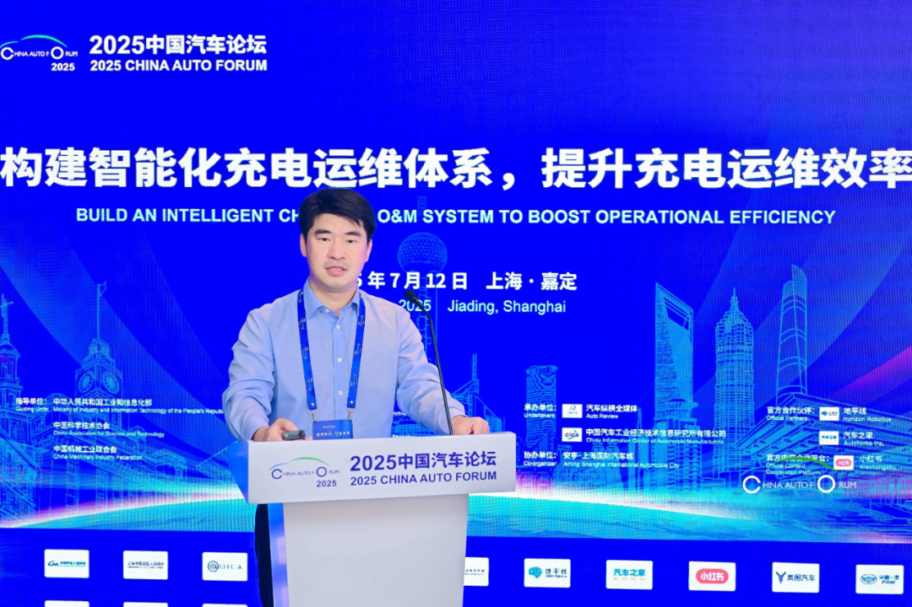

2025年7月10-12日，2025中国汽车论坛在上海嘉定举办。本届论坛主题为"提质向新，智赢未来"。在7月12日上午举办的"主题论坛十：构建智能化充电运维体系，提升充电运维效率"上，小桔能源首席技术官廖兰新发表了精彩演讲。以下内容为现场演讲实录：

尊敬的各位领导、专家，以及线上线下的同行们，大家上午好！

我是来自小桔能源的廖兰新。今天非常荣幸，受到了中国汽车论坛的邀请，跟大家一起探讨智能运维的话题。

小桔充电专注投入智能运维技术的研发是大约是2020年，差不多有5年时间。最早的出发点是，如何通过技术分析来自动识别设备异常，从而敦促我们的商户、供应商及时维修。

我今天的主题是：以智能运维技术为核心，构建本地化运维服务生态。分享小桔充电智能运维技术的探索过程，以及如何将技术转化为产品，为生态伙伴赋能。

构建高质量充电基础设施，已经逐步成为了行业共识。2023年6月，著名的"国办19号文"——《关于进一步构建高质量充电基础设施体系的指导意见》对高质量充电设施建设提出了一系列指导意见，特别强调了建设充电基础设施运维体系，提升设备可用率和故障处理能力；2024年12月，国家能源局召开了《2024年推进高质量充电基础设施体系建设座谈会》；今年7月，国家发改委等四部门联合发布《关于促进大功率充电设施科学规划建设的通知》，对充电运营企业提出明确要求，加快建设智能运维平台，也提出了可用率不低于98%的具体要求。

海量的充电设备，以及可能发生的故障，给各方都提出了难题。用户持续受到无法充电、充电跳枪、充电慢等情况的困扰；商家等到设备过了保修期才发现，每年的运维费用可能是设备购置成本的20%以上；桩企也面临布局运维团队的人员成本和管理效率问题。

作为连接三方的充电运营平台，有责任为商户和桩企提供运维支持，为用户提供可靠的服务体验。小桔充电设备运维长期面临诸多挑战：首当其冲，我们面临"百家桩"，数据协议、运维流程不统一，导致管理难度很高；其次，从异常发现、到定位、到维修恢复，周期长，设备长期不可用；最后，现场运维、跨城运维带来的巨大成本，导致商户和桩企维修意愿低。

面对设备运维，小桔充电一致坚持"智能化"的技术路线。第一阶段是数字化，主要是实现运维工单的线上化；第二阶段是智能化，使用了统计机器学习、知识推理、远程OTA等技术完成了智能化升级；第三阶段是生态化，引入本地化的第三方运维服务商，大幅降低了运维成本和提升了运维效率。

2023年9月，我们向行业分享了充电桩智能化的五大关键技术，智能运维就是其中之一。在当天的分论坛会议上，我们与八家单位联合发布了《电动汽车充电设施智能运维技术白皮书》。

小桔智能运维技术的背后，关键是三大引擎：第一是异常识别引擎，主要依赖传统的机器学习算法来拟合异常枪的特征；第二是故障诊断引擎，主要依赖知识库、知识推理技术，辅助维修人员做故障归因分析；第三是故障恢复引擎，主要依赖远程OTA、预置一些恢复策略。目前有25%的故障是可以通过引擎来自动或者远程恢复。

最近两年，我们把智能运维深入到了充电模块，打造了"模块级"的运维能力。我们为模块规划了更多的传感器，并将数据采集上来，融入到智能运维模型中。

在智能运维技术之外，运维服务市场的供需情况也发生了比较大的变化。本地化运维需求逐步上升，同时地方性运维服务商开始兴起。我们重点参考家电行业的维修售后发展路径，从品牌售后服务体系逐步转向专业化的本地维修服务平台。

我们构建了一个本地化运维服务平台，为交易市场的供需两侧实现双边支持。商户侧解决降成本、提效率、保质量三个问题；服务商侧提供精准获客、品牌背书、技术赋能三大能力。

目前，我们已经引入了150家以上本地运维服务商，其中有1万枪以上是由本地运维服务商去维修的，有效补充了偏远地区的运维能力。设备可用率稳中有升，充电异常率持续下降。

小桔充电智能运维经过了5年的发展，完成了从数字化、到智能化、再到生态化的过程。未来，期待越来越多的本地化运维生态伙伴加入，共同推动充电基础设施高质量发展！

（注：本文根据现场速记整理，未经演讲嘉宾审阅）

## 图片

