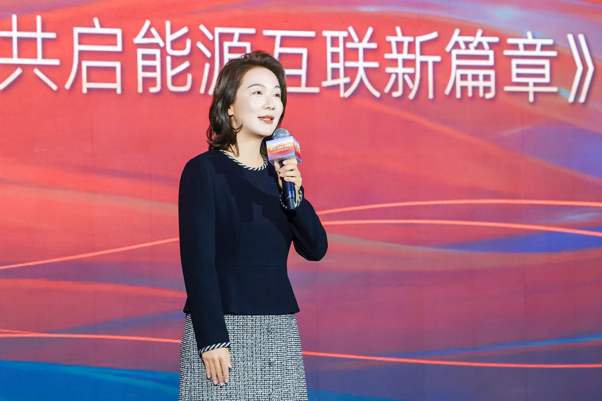
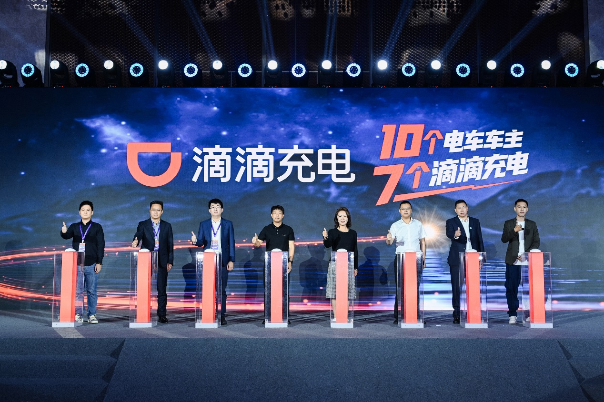

11月25日，小桔充电在深圳举办2025年度合作伙伴大会，宣布更名为"滴滴充电"，启用新品牌标语"10个电车车主7个滴滴充电"，升级用户体验，旨在打造用户首选的充电服务品牌。

滴滴能源总经理解晶晶表示，新能源产业正全面转向"市场驱动"与"用户价值驱动"。新升级的滴滴充电将携手合作伙伴为用户提供行业领先的充电服务。

作为滴滴旗下数智化充电运营商，小桔充电自2018年成立之初就承载着"为美好永续世界充电"的使命，致力于通过全国充电网络，为用户提供便捷、安全、高效的充电服务。

"此次更名，不仅是名称的变更，更是服务承诺的全面升级。"滴滴能源副总经理林枝棠表示，升级后的滴滴充电将从"好找、好充、好快、好安全"四个方向全面提升用户体验。

滴滴充电为用户打造"3公里内就在你身边的充电站"，服务覆盖全国超270座城市62000余座充电站。在大部分城市的核心出行区域，用户在方圆3公里内即可找到滴滴充电的场站，缓解"找桩难题"。

滴滴充电的充电桩可用率达97%以上。为解决充电过程中，因设备异常导致充电中断（跳枪）的用户痛点，滴滴充电推出行业首创的"跳枪赔付"服务。

充电服务在各环节被提速，快在充电每一步。目前，滴滴充电已实现快充枪全覆盖，"极速启动"功能将平均启动时长缩短至10秒左右，"加速充"服务让用户充电速度平均提升8%。

滴滴充电还通过"电池健康卫士"等多项安全举措，护航整个充电过程。

在本次大会上，国家发展和改革委员会能源研究所、中国电力企业联合会、清华大学能源互联网创新研究院、如是金融研究院等机构多位专家，全国数百家充电服务商及充电桩企业等合作伙伴出席，共议行业高质量发展，共同为提升用户服务体验建言献策。

## 图片

