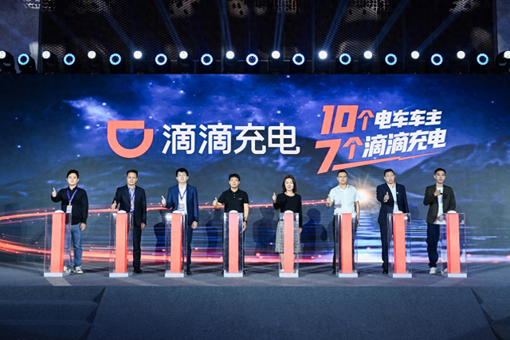

# 小桔充电更名"滴滴充电"

11月25日，小桔充电在深圳举办2025年度合作伙伴大会，宣布更名为"滴滴充电"，启用新品牌标语"10个电车车主7个滴滴充电"，升级用户体验，旨在打造用户首选的充电服务品牌。

目前，新能源行业进入全新阶段，全国新能源汽车保有量渗透率突破10%，新车销售渗透率超过50%。滴滴充电观察到，新能源车主对充电桩的需求从"有桩可充"转向"充得好、充得快、充得更安全"，新能源产业也相应全面转向"市场驱动"与"用户价值驱动"。

"此次更名，不仅是名称的变更，更是服务承诺的全面升级。"滴滴能源副总经理林枝棠表示，升级后的滴滴充电将从"好找、好充、好快、好安全"四个方向全面提升用户体验。

"好找"方面，滴滴充电将打造"3公里内就在你身边的充电站"，服务覆盖全国超270座城市62000余座充电站。在大部分城市的核心出行区域，用户在方圆3公里内即可找到滴滴充电的场站，缓解"找桩难题"。

"好充"方面，滴滴充电的充电桩可用率达97%以上。为解决充电过程中，因设备异常导致充电中断（跳枪）的用户痛点，滴滴充电推出行业首创的"跳枪赔付"服务。

"好快"方面，充电服务在各环节被提速。目前，滴滴充电已实现快充枪全覆盖，"极速启动"功能将平均启动时长缩短至10秒左右，"加速充"服务让用户充电速度平均提升8%。此外，滴滴充电还通过"电池健康卫士"等多项安全举措，护航充电过程。

作为滴滴旗下数智化充电运营商，小桔充电自2018年成立之初就致力于通过全国充电网络，为用户提供便捷、安全、高效的充电服务。现场披露的数据显示，截至2025年9月底，公司已在全国270多座核心城市，直连在线快充枪超26万把，累计合作商户11000余家，实现碳减排约1700多万吨。

## 图片

